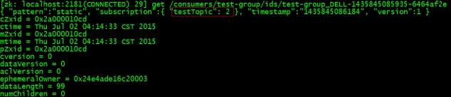

### kafka
```shell script
producer
# 生产者：往partition写数据,分区方便kafka横向扩展,提高并发和吞吐量,这样集群就可以适应任意大小的数据量
consumer
# 消费者：可以消费同一个broker上的多个partition,依赖zookeeper在消费者端做负载均衡
consumer-group
# 消费者组：每个consumer负责消费不同partition的数据,一个partition只能被组内的一个consumer消费,消费者组之间互不干扰,消费者组是逻辑上的订阅者
broker
# 节点：负责处理消息的读写请求以及存储消息,kafka集群由多个broker组成,broker本身没有主从,依赖zookeeper做协调服务,一个broker可以容纳多个topic
topic
# 消息队列/消息分类：一个topic分成多个partition,分区是为了让消费者并行处理,分区内部消息有序先进先出,topic是逻辑的partition是物理的
partition
# 分区：每个partition对应一个log文件,producer生产的数据会不断追加到文件末尾,且每条数据都有自己的offset,保存在kafka的内置topic __consumer_offsets
replication
# 副本：为了保证高可用性,每个partition都有副本,leader负责工作,follower负责同步数据,当leader节点故障时某个follower会成为新的leader
segment
# 片段：为了防止log文件过大导致数据难以定位,将log文件分为多个segment,包含.index(存储大量索引)和.log(存储大量数据),文件以当前segment第一条消息的offset命名
offset
# 消息的偏移量：以消费者组为单位进行维护,如果以消费者为单位维护的话,其中某个消费者挂掉了那么这个offset就丢失了,当partition或consumer数量发生变化时,会触发kafka的rebalance机制重新分配分区,这对消费者组并没有影响,所以offset是以消费者组为单位维护

# 启动kafka,默认是前台进程,可以在后台启动
[root@cdh1 ~]$ bin/kafka-server-start.sh -daemon /config/server.properties | nohup bin/kafka-server-start.sh config/server.properties > (logs/kafka.log | /dev/null) 2>&1 &
# 查找kafka进程
[root@cdh1 bin]$ ps -aux | grep -i 'kafka' | grep -v grep | awk '{print $2}'
# 创建topic,指定分区数和副本数
[root@cdh1 ~]$ bin/kafka-topics.sh --zookeeper cdh1:2181 --create --topic t01 --partitions 3 --replication-factor 2
Created topic "t01".
# 查看topic列表/详细信息
[root@cdh1 ~]$ bin/kafka-topics.sh --zookeeper cdh1:2181,cdh2:2181,cdh3:2181 --list
[root@cdh1 ~]$ bin/kafka-topics.sh --zookeeper cdh1:2181,cdh2:2181,cdh3:2181 --describe --topic t01
Topic:t01       PartitionCount:3        ReplicationFactor:2     Configs:
Topic: t01      Partition: 0    Leader: 2       Replicas: 2,1   Isr: 2,1  # 0/1/2表示broker.id, Isr存放和leader保持同步的副本集合,有follower挂掉就剔除
Topic: t01      Partition: 1    Leader: 0       Replicas: 0,2   Isr: 0,2
Topic: t01      Partition: 2    Leader: 1       Replicas: 1,0   Isr: 1,0
# 修改topic分区数,只能增加不能减少,因为partition可能已经有数据
[root@cdh1 ~]$ bin/kafka-topics.sh --zookeeper cdh1:2181 --alter --topic t01 --partitions 2
WARNING: If partitions are increased for a topic that has a key, the partition logic or ordering of the messages will be affected
Adding partitions succeeded!
# 删除topic
[root@cdh1 ~]$ bin/kafka-topics.sh --zookeeper cdh1:2181 --delete --topic t01
# 在zk中查看/删除,kafka0.8版本是zk保存offset,kafka0.10版本是自己保存offset,数据是放在broker节点
[zk: localhost:2181(CONNECTED) 0] ls /brokers/topics/t01 | rmr /brokers/topics/t01
# 生产者
[root@cdh1 ~]$ bin/kafka-console-producer.sh --broker-list cdh1:9092,cdh2:9092,cdh3:9092 --topic t01
>java hadoop
# 消费者,--from-beginning表示读取主题中以往所有数据
[root@cdh1 ~]$ bin/kafka-console-consumer.sh --bootstrap-server cdh1:9092 [--from-beginning] --topic t01
java hadoop
# 查看consumer group列表/详细信息
[root@cdh1 ~]$ bin/kafka-consumer-groups.sh --bootstrap-server cdh1:9092,cdh2:9092,cdh3:9092 --list
[root@cdh1 ~]$ bin/kafka-consumer-groups.sh --bootstrap-server cdh1:9092,cdh2:9092,cdh3:9092 --describe --group g01
```

### install
```shell script
# 修改配置文件
[root@cdh1=~]# vim server.properties
############################# Server Basics #############################
# broker的全局唯一编号,不能重复
broker.id=0
# 开启删除topic功能,否则只是标记删除并没有真正删除
delete.topic.enable=true
############################# Socket Server Settings #############################
# 处理网络请求的线程数
num.network.threads=3
# 处理磁盘io的线程数
num.io.threads=8
# 发送套接字的缓冲区大小
socket.send.buffer.bytes=102400
# 接收套接字的缓冲区大小
socket.receive.buffer.bytes=102400
# 请求套接字的最大值
socket.request.max.bytes=104857600
############################# Log Basics #############################
# kafka运行日志存放路径
log.dirs=/opt/module/kafka/logs
# topic在当前broker上的分区个数
num.partitions=1
# 恢复和清理data下数据的线程数
num.recovery.threads.per.data.dir=1
############################# Internal Topic Settings  #############################
# The replication factor for the group metadata internal topics "__consumer_offsets" and "__transaction_state"
# For anything other than development testing, a value greater than 1 is recommended for to ensure availability such as 3.
offsets.topic.replication.factor=1
transaction.state.log.replication.factor=1
transaction.state.log.min.isr=1
############################# Log Retention Policy #############################
# log文件保留时长
log.retention.hours=168
# segment文件最大值
log.segment.bytes=1073741824
############################# Zookeeper #############################
# zk地址
zookeeper.connect=cdh1:2181,cdh2:2181,cdh3:2181
# zk连接超时时间(毫秒)
zookeeper.connection.timeout.ms=6000
############################# Group Coordinator Settings #############################
group.initial.rebalance.delay.ms=0

# 添加到环境变量
[root@cdh1 ~]# vim /etc/profile && source /etc/profile
export KAFKA_HOME=/opt/module/kafka
export PATH=$PATH:$KAFKA_HOME/bin

# 分发到其他节点
scp -r kafka cdh2:/opt/module/kafka && broker.id=1
scp -r kafka cdh3:/opt/module/kafka && broker.id=2
```

### Q & A
```shell script
# 消息队列和普通队列区别
java提供了各种各样的队列类,但都是程序中基于内存的单机版队列,MQ通常是分布式队列并且数据可以持久化
java提供了HashMap存储key-value数据,但是很多时候还是会用到Redis(可以将数据持久化到磁盘,redis挂了可以从磁盘恢复)
# 消息队列缺点
为了保证消息队列的高可用就得使用分布式,为防止数据丢失还要考虑持久化,这些都会提高系统的复杂性
# 消息队列应用场景
异步：页面注册 - 写数据库 - 调用发短信接口(略耗时,可以将发短信请求写入MQ) - 响应用户(短信接口作为消费者会轮询MQ读取数据发送短信,用户不用等待这个操作消耗的时间)
解耦：A系统生产数据通过接口调用发送到BCD系统,随着业务发展C不要了D挂了E又要了A要忙死...A将数据发送到MQ需要的自己去取,A不用考虑发给谁以及是否调用成功
缓冲：秒杀活动瞬间产生大量请求(5K个/秒)系统处理不完(2K个/秒)导致崩溃,可以将请求写入MQ,系统按照自己消费能力pull数据,高峰期后请求急剧减少(50个/秒),系统很快就会将积压的消息处理掉
# 消息队列两种模式
点对点模式(一对一)：一个消息只能被一个消费者消费,消费完就从queue移除
发布-订阅模式(一对多)：kafka生产者发布消息到topic,消费者订阅该消息,一个消息可以被多个消费者消费,且消费完不会立马清除而是保存一段时间

# kafka生产者
# 分区策略
a.指定partition
b.没有指定partition但是有key,将key的hash值与partition数进行取余决定往哪个partition写数据
c.没有指定partition也没有key,将递增的随机数与partition数进行取余决定往哪个partition写数据,这就是round-robin算法(轮询)

# 数据可靠性保证
为了保证producer往topic发送数据的可靠性,每个partition收到数据后都要向producer发送ack确认,producer收到ack才会进行下一轮发送,否则重新发送数据
# 1).副本同步策略
半数以上follower完成同步就发送ack,优点是延迟低,缺点是选举新的leader时容忍n个节点的故障需要2n+1个副本,会造成大量数据冗余
所有follower完成同步才发送ack,优点是选举新的leader时容忍n个节点的故障只需要n+1个副本,缺点是延迟高,有的节点同步速度很慢但是也要等它
kafka采用的是第二种,因为网络延迟对kafka的影响相较于数据冗余要小很多
# 2).Isr
既然是所有follower同步完成才会发送ack,如果有一个follower故障导致迟迟不能与leader同步,也要一直等它同步结束才发送ack吗?
leader维护了一个动态的Isr(in-sync replica set),存放和leader保持同步的follower集合,当Isr中的follower完成同步之后,leader就会向producer发送ack
如果follower长时间没有向leader同步数据就会被Isr剔除,该时间阈值由replica.lag.time.max.ms参数设定,如果leader故障就从Isr中选举新的leader
# 3).ack应答机制
有些不是很重要的数据对可靠性要求不高,允许有少量数据丢失,所以没必要等到Isr中的follower全部同步成功
kafka提供了3种可靠性级别,用户可以根据可靠性和延迟性进行权衡
ack=0 producer不等待broker的ack,leader一接收到数据还没写磁盘就返回ack,如果leader故障会丢失数据
ack=1 producer等待broker的ack,leader落盘成功后会返回ack,如果在follower同步结束之前leader故障也会丢失数据
ack=-1(all) producer等待broker的ack,leader和follower全部落盘成功后才会返回ack,如果在follower同步成功之后发送ack之前leader故障,producer会重发数据导致数据重复
# 4).数据一致性
LEO(log end offset 每个副本的最后一个offset)和HW(high watermark 所有副本中最小的LEO) 只能保证数据一致性,并不能保证数据不丢失或不重复,要么都丢数据要么都数据重复
follower故障会被临时踢出Isr,恢复后会读取本地磁盘记录的上次的HW,并将log文件高于HW的部分截掉,从HW开始从leader同步,等到该follower的LEO>=该partition的HW时,即follower追上leader了,可以重新加入Isr
leader故障会从Isr中选取新的leader,为保证各个副本数据的一致性,其余follower会先将各自log文件高于HW的部分截掉,然后从新的leader同步数据
# 5).精准消费
at most once 可能会丢数据 | at least once 可能重复消费 | exactly once 精准消费,保证每条消息都会被发送且仅发送一次
kafka0.11版本引入了幂等性机制(idempotent),配合ack=-1时的at least once实现producer到broker的exactly once
设置enable.idempotence属性为true,kafka自动修改ack=-1, idempotent + at least once = exactly once

# kafka消费者
# 消费方式
push模式难以适应消费速率不同的消费者,因为发送速率由broker决定,消费者来不及处理会导致网络堵塞甚至程序崩溃
consumer采用pull模式从broker读取数据,根据自身消费能力消费数据,缺点是broker中没有数据时会陷入循环返回空数据,所以consumer在消费数据时会传入超时参数timeout,没有数据时会等待timeout时长


# zk在kafka中的作用
zookeeper主要是辅助KafkaController进行管理
kafka集群中有一个broker会被选举为Controller,负责管理broker上下线/topic的分区副本分配/leader选举等工作,这些都依赖于zk

# partition的分配策略：确定哪个partition由哪个consumer消费
roundrobin：先按照每个partition的hash值排序,然后轮询分配给consumer
range：针对partition和consumer的个数按照范围分配

# kafka高低阶消费者？
基于receiver的方式,使用kafka高阶api在zk中保存消费过的offset,配合wa机制可以保证数据零丢失,但是数据可能不止一次被消费,因为spark和zk可能是不同步的
基于direct的方式,使用kafka低阶api由SparkStreaming自己追踪消费的offset并保存在checkpoint,保证数据只消费一次(常用)

# spark streaming接收数据两种方式
receiver模式：offset存储在zookeeper,由receiver维护,spark获取数据存入executor中,调用kafka高阶api
direct模式：offset存储在zookeeper,由spark维护,且可以从每个分区读取数据,调用kafka低阶api

# 可靠性保证？
自己不丢数据：不管数据是否被消费,kafka默认会保留最近7天的数据
消费者不丢数据：至少一次,严格一次,记录丢数据的max(timestamp),将offset设置为这个时间戳重新消费

# kafka的zero copy技术？
kafka吞吐量高就是靠的磁盘的零拷贝技术

# kafka的leader均衡机制
集群中有broker节点挂掉,kafka会将该节点管理的partition按照副本优先原则寻找新的leader
集群中挂掉的broker重启后,kafka会重新管理该节点的partition做一次均衡,周期: leader.imbalance.check.interval.seconds 300s
```

### api
```java
public class ProducerDemo {  
    public static void main(String[] args) throws Exception {  
        //新建属性  
        Properties prop = new Properties();  
        //添加连接的zookeeper  
        prop.put("zookeeper.connect", "cdh01:2181,cdh02:2181,cdh03:2181");  
        //添加kafka服务器列表  
        prop.put("metadata.broker.list", "cdh01:9092,cdh02:9092,cdh03:9092");  
        //添加数据的序列化类  
        prop.put("serializer.class", "kafka.serializer.StringEncoder");  
        //新建producer配置信息  
        ProducerConfig config = new ProducerConfig(prop);  
        //创建producer  
        Producer<String,String> producer = new Producer<>(config);  
        //生产消息  
        for (int i = 0; i < 100; i++) {  
            //设置线程休眠时间(不然会一直不停的发)  
            Thread.sleep(100);  
            //发送消息  
            producer.send(new KeyedMessage<String,String>("replicationgirls", "hehe"+i));  
        }  
    }  
}  

public class ConsumerDemo {  
    public static void main(String[] args) {  
        //新建属性  
        Properties prop = new Properties();  
        //添加zookeeper连接  
        prop.put("zookeeper.connect", "cdh01:2181,cdh02:2181,cdh03:2181");  
        //添加group  
        prop.put("group.id", "001");  
        //添加offset（kafka支持从指定偏移量读取消息）  
        prop.put("auto.offset.reset", "smallest");  
        //新建consumer配置信息  
        ConsumerConfig config = new ConsumerConfig(prop);  
        //API编写入口  
        ConsumerConnector consumer = Consumer.createJavaConsumerConnector(config);  
        //用map集合封装多个topic：String表示topic名称，Integer表示线程数  
        HashMap<String,Integer> map = new HashMap<>();  
        map.put("replicationgirls", 3);  
        map.put("replicationboys", 2);  
        map.put("replicationstudents", 1);  
        //创建消息流：String表示topic名称，List有多个线程在跑这个消息流  
        Map<String,List<KafkaStream<byte[],byte[]>>> MessageStreams = consumer.createMessageStreams(map);
        //获取指定topic的streams：两个byte[]分别表示消息体和消息内容  
        List<KafkaStream<byte[], byte[]>> streams = MessageStreams.get("replicationgirls");  
        //遍历循环streams，有几个kafkaStream就new几个线程  
        for (final KafkaStream<byte[], byte[]> kafkaStream : streams) {  
            new Thread(new Runnable() {  
                @Override  
                public void run() {  
                    //遍历每个kafkaStream，获取message和metadata  
                    for (MessageAndMetadata<byte[], byte[]> mm : kafkaStream) {  
                        //获取message  
                        String msg = new String(mm.message());  
                        //接下来是数据处理的业务逻辑  
                        System.out.println(msg);  
                    }  
                }  
            }).start();  
        }  
    }  
}  
```

### zookeeper监控
kafka启动时会在zookeeper上创建brokers节点和consumers节点。  
    
ids：监控broker是否存活     格式: /brokers/ids/[0...N]    
  
topics：查找partition在哪台broker上     格式: /brokers/topics/[topic]/partitions/[0...N]   
  
  
owners：标记partition被组内哪个consumer消费.临时znode。  
格式: /consumers/[group_id]/owners/[topic]/[broker_id-partition_id]  
    
    
ids：记录该组中的consumer消费的topic的partition个数  
格式: /consumers/[group_id]/ids/[consumer_id]  
  
offsets：跟踪每个consumer组目前所消费的partition中最大的offset。    
格式: /consumers/[group_id]/offsets/[topic]/[broker_id-partition_id]  
  
